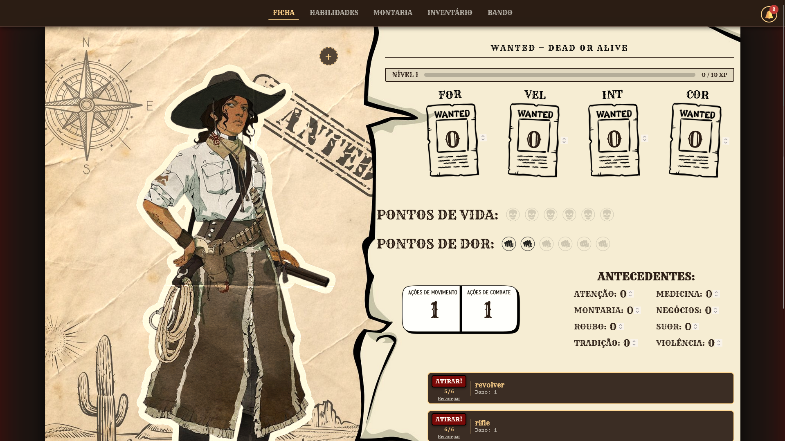
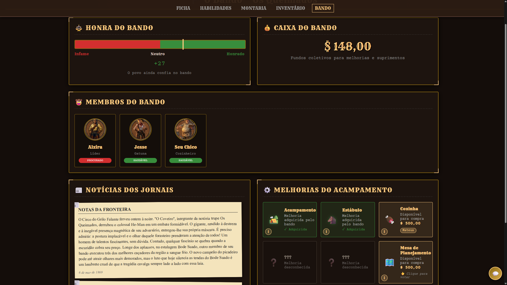

# 🎲 RPG Realtime Sheet

Ficha de personagem minimalista e reativa para sessões de RPG de Mesa (TTRPG). O sistema permite que jogadores e mestres vejam atualizações de vida, atributos e inventário instantaneamente, sem necessidade de atualizar a página.

## � Preview

<!-- Adicione screenshots das telas principais aqui -->
<!-- Exemplo de como adicionar suas imagens: -->

  
  
<em>Ficha de personagem com atributos e vida</em>

  
  
<em>Sistema de inventário do personagem</em>

  
  
<em>Tela para os jogadores acomaparanhem a evolução do bando, e votar em melhorias.</em>

## �🚀 Tecnologias

- **Frontend:** HTML5, CSS3 e Javascript (Vanilla).
- **Backend/Realtime:** [Supabase](https://supabase.com/) (PostgreSQL + WebSockets).
- **Hospedagem:** Vercel (ou compatível com qualquer host estático).

## ✨ Funcionalidades

- **Sincronização em Tempo Real:** Alterações feitas em uma aba refletem imediatamente para todos os usuários conectados.
- **Estrutura Flexível:** Uso de colunas `JSONB` no banco de dados, permitindo adicionar campos novos à ficha sem precisar de migrações complexas.
- **Zero Config:** Não requer instalação de Node.js localmente para rodar (usa CDN).

## 🛠️ Como rodar localmente

1. Clone o repositório.
2. Crie um projeto no Supabase e uma tabela `Fichas` com a coluna `atributos` (JSONB).
3. Ative o **Realtime** na tabela criada.
4. Substitua as variáveis `SUPABASE_URL` e `SUPABASE_KEY` no arquivo `index.html`.
5. Abra o `index.html` no navegador.

---

Desenvolvido para uma One-Shot de Velho Oeste, mas adaptável para qualquer sistema.
